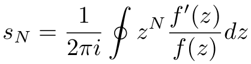

# complex-zeros-delves-lyness

> Compute the zeros of a complex analytic function using the method of Delves and Lyness

## Introduction

Given a complex analytic function and its derivative, this module uses [the method of Delves and Lyness](http://www.ams.org/mcom/1967-21-100/S0025-5718-1967-0228165-4/S0025-5718-1967-0228165-4.pdf) [[1]](#References) to compute the zeros. That is, it computes <p align="center"></p> numerically using [adaptive Simpson's method](https://github.com/scijs/integrate-adaptive-simpson) integration. In the absence of poles, [Cauchy's argument principle](https://en.wikipedia.org/wiki/Argument_principle) states <em>s<sub>0</sub></em> is the number of zeros <em>M</em>. Using [Newton's Identities](https://en.wikipedia.org/wiki/Newton%27s_identities), the moments <em>s<sub>1</sub></em> through <em>s<sub>M</sub></em> are transformed into a polynomial, the roots of which correspond to the encircled zeros of the function <em>f</em> and which may be computed with a complex polynomial root-finder like the [Weierstrass](http://github.com/scijs/durand-kerner) method.

## Todo

This module currently applies the method successfully with the following exceptions:
- Does not account for poles
- Does not implement recursive subdivision (= robustness when the contour intersects a zero or the contour contains an excessive number of zeros)

## Installation

Can be installed from github, but not currently published.

## Example

The single zero of the function <em>cos(z) + sin(z)</em> inside the unit circle is <em>z<sub>0</sub> = -π / 4</em>:

```javascript
var zeros = require('complex-zeros-delves-lyness');

function f (out, a, b) {
  out[0] = Math.cosh(b) * (Math.cos(a) + Math.sin(a));
  out[1] = Math.sinh(b) * (Math.cos(a) - Math.sin(a));
};

function fp (out, a, b) {
  out[0] = Math.cosh(b) * (Math.cos(a) - Math.sin(a));
  out[1] = -Math.sinh(b) * (Math.cos(a) + Math.sin(a));
};

zeros(f, fp, [0, 0], 1);
// => [ [ -0.785398350762156 ], [ 3.289335470668675e-11 ] ]
```

Since <em>f</em> and <em>f'</em> are used 1-1 and often repeat many identical operations, they may be computed together and returned as the third and fourth entries of the output array:

```javascript
function f (out, a, b) {
  var chb = Math.cosh(b);
  var shb = Math.sinh(b);
  var ca = Math.cos(a);
  var sa = Math.sin(a);
  out[0] = chb * (ca + sa);
  out[1] = shb * (ca - sa);
  out[2] = chb * (ca - sa);
  out[3] = -shb * (ca + sa);
};

zeros(f, null, [0, 0], 1);
// => [ [ -0.785398350762156 ], [ 3.289335470668675e-11 ] ]
```

## Usage

#### `require('complex-zeros-delves-lyness')(f, fp, z0, r, tol, maxDepth)`

Compute the zeros of a complex analytic function.

**Arguments**:
- `f: function(out: Array, a: Number, b: Number)`: a function that places the real and imaginary components of <em>f(a + ib)</em> into the first and second elements of the output array.
- `fp: function(out: Array, a: Number, b: Number)`: a function that places the real and imaginary components of <em>f'(a + ib)</em> into the first and second elements of the output array. If `fp` is `null`, argument `f` may instead place the real and imaginary components of <em>f'</em> into the third and fourth elements of the output of `f`.
- `z0: Array`: an `Array` specifying the real and imaginary components of the center of the contour around which to integrate. Default is `[0, 0]`.
- `r: Number`: the radius of the contour. Default is `1`.
- `tol`: tolerance used in the integration and polynomial root-finding steps. Default is `1e-8`.
- `maxDepth`: maximum recursion depth of the adaptive Simpson integration. Default is `20`.

**Returns**:
Returns `false` on failure, otherwise an array containing an `Array` containing `Arrays` of the real and imaginary components of the zeros, respectively. That is, <em>1 + 2i</em> and <em>3 + 4i</em> would be returned as `[[1, 3], [2, 4]]`.

## References
[1] Delves, L. M., & Lyness, J. N. (1967). [A numerical method for locating the zeros of an analytic function](http://www.ams.org/mcom/1967-21-100/S0025-5718-1967-0228165-4/S0025-5718-1967-0228165-4.pdf). Mathematics of Computation.

## License

&copy; 2016 Ricky Reusser. MIT License.

[npm-image]: https://badge.fury.io/js/complex-zeros-delves-lyness.svg
[npm-url]: https://npmjs.org/package/complex-zeros-delves-lyness
[travis-image]: https://travis-ci.org/rreusser/complex-zeros-delves-lyness.svg?branch=master
[travis-url]: https://travis-ci.org//complex-zeros-delves-lyness
[daviddm-image]: https://david-dm.org/rreusser/complex-zeros-delves-lyness.svg?theme=shields.io
[daviddm-url]: https://david-dm.org//complex-zeros-delves-lyness